# Node.js 로 챗봇 개발하기

안녕하세요, Microsoft Bot Framework에서는 Node.js 용 Bot Builder SDK를 제공하기 떄문에 누구나 봇을 쉽게 만들 수 있습니다. Node.js 기반의 챗봇을 개발하기 위해 필요한 환경구성을 설명해드립니다. (윈도우 기준으로 작성)

## 설치해야 하는 것

* [Node.js 다운로드](https://nodejs.org/en/)
: Node.js는 자바스크립트 언어로 작성되는 서버 개발에 주로 쓰이는 소프트웨어 플랫폼 입니다. 위의 링크를 통해 다운받으실 수 있으며 설치 방법은 [생활코딩의 nodejs 설치 강좌](https://opentutorials.org/course/2136/11852)를 참고해보시기 바랍니다. :)

* [Bot Framework Emulator 다운로드](https://emulator.botframework.com/)
: [Bot Framework Emulator](https://docs.microsoft.com/en-us/bot-framework/debug-bots-emulator)를 이용하여 봇 개발시 내가 만들 봇을 테스트하고 디버깅 할 수 있습니다. 또한 봇과 어떤 메세지가 오가는지 상세하게 살펴보실 수도 있습니다! 


* (Optional) [Visual Studio Code 다운로드](https://www.visualstudio.com/ko/)
: Visual Studio Code는 Microsoft에서 만든 에디터입니다. 써보면 아시겠지만 가볍고 여러 유용한 기능들을 많이 제공하기 때문에 개발시 생산성을 무척 높일 수 있습니다. 


* (Optional) [Git 다운로드](https://git-scm.com/book/ko/v1/%EC%8B%9C%EC%9E%91%ED%95%98%EA%B8%B0-Git-%EC%84%A4%EC%B9%98)
: 소프트웨어의 형상 관리를 위한 도구로 앞으로 만들 프로젝트의 소스코드 관리 및 github에 올라와있는 여러 샘플들을 다운로드 받을 때 유용합니다. 

## 시작하기

1. Node 프로젝트 저장할 폴더를 만드시기 바랍니다. 저는 편의상 Documents 폴더 및 Projects 폴더 아래에 Node라는 폴더를 생성하였습니다. (C:\Users\eunk\Documents\Project\Node)
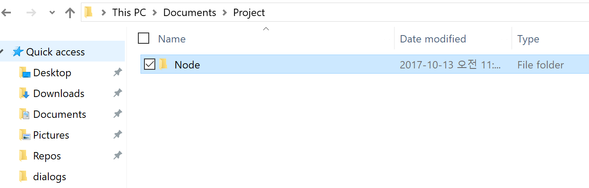

2. 커맨드 프롬프트(CMD)를 열고 방금 생성한 경로로 들어가시기 바랍니다.
명령어 창에 **cd [경로주소]** 를 입력하시기 바랍니다. (예시) cd C:\Users\eunk\Documents\Project\Node
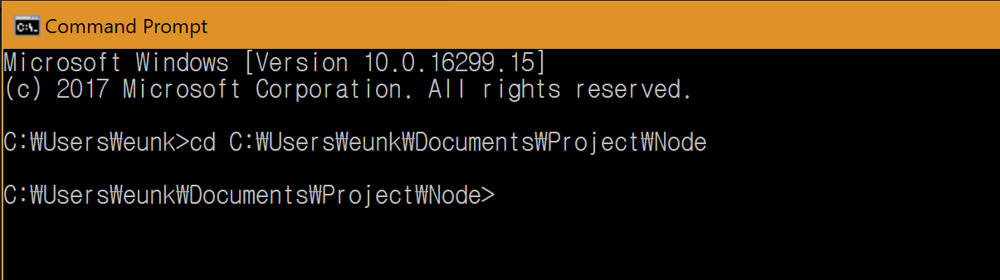

3. 첫번째 봇 프로젝트를 위한 폴더를 하나 생성하겠습니다. 현재 디렉토리에서 **mkdir MyFirstBot**을 입력하여 폴더를 하나 생성한 후, **cd MyFisrtBot**명령어를 통해 해당 폴더로 이동하도록 하겠습니다. 
```
mkdir MyFirstBot
cd MyFisrtBot
```
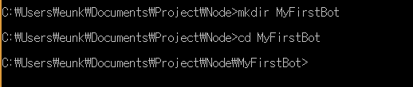

4. Node.js에서 쓰는 패키지 관리자인 npm을 초기화 하는 과정이 필요합니다. 명렁어 창에 **npm init**을 입력하시기 바랍니다.
```
npm init
```
입력하시면 관련하여 초기 셋팅에 필요한 정보들을 물어봅니다. 
관련하여 필요한 사항들 입력하시고 마지막에 yes를 입력하시면 초기 셋팅이 완료됩니다!
(Tip! 입력시에 Enter를 치시면 기본 값으로 자동 셋팅 됩니다!)
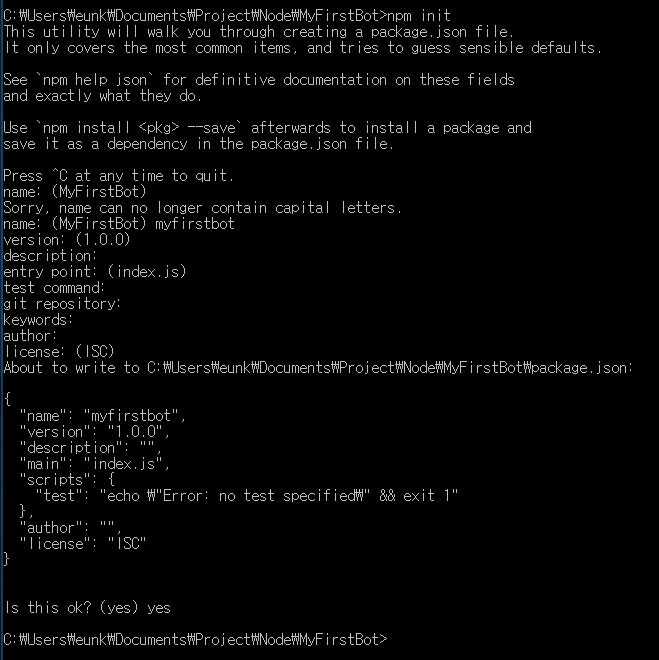

5. Node.js 용 Bot Builder SDK를 다운받겠습니다. 명령행 창에 **npm install --save botbuilder**를 입력하시기 바랍니다.
```
npm install --save botbuilder
```
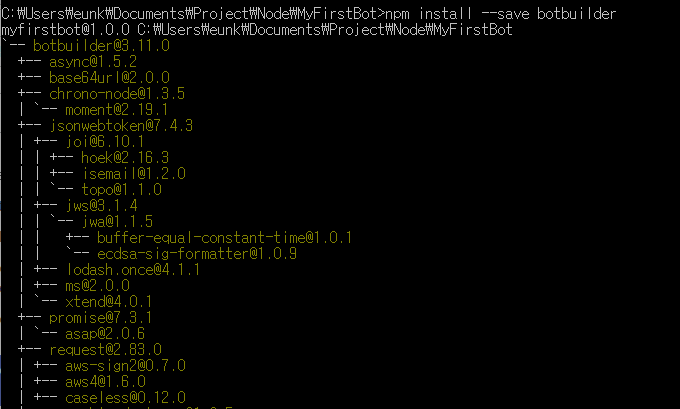

6. 이제 Node.js 기반의 봇을 만들어 보겠습니다. 앞에서 설치하신 Visual Studio Code를 오픈하시기 바랍니다. 
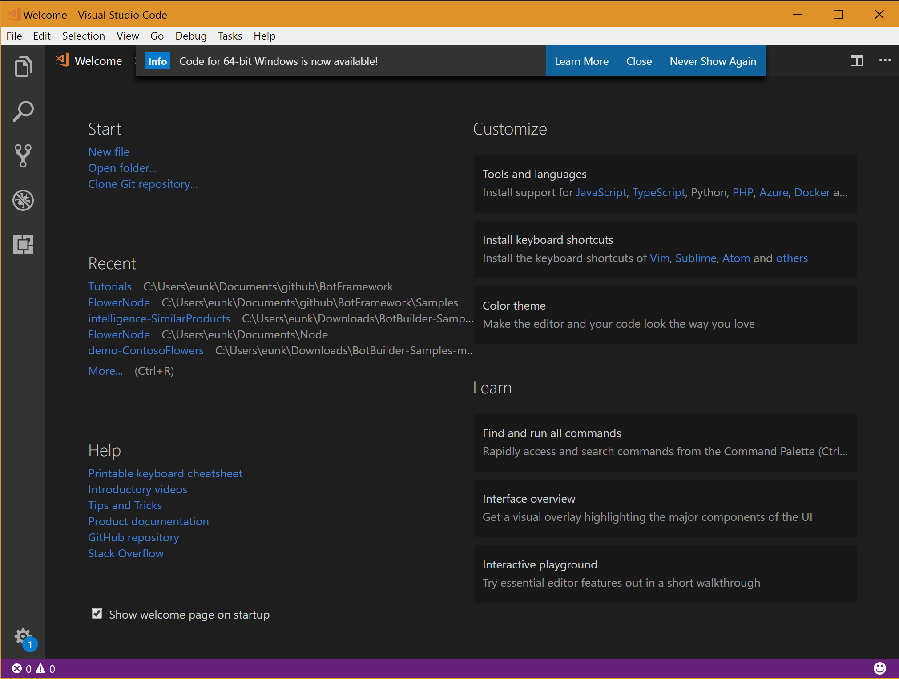

7. 상단의 바에서 **File > Open Folder**를 선택 하신후, MyFirstBot이 저장된 위치로 이동하셔서 해당 폴더를 오픈하시기 바랍니다. 
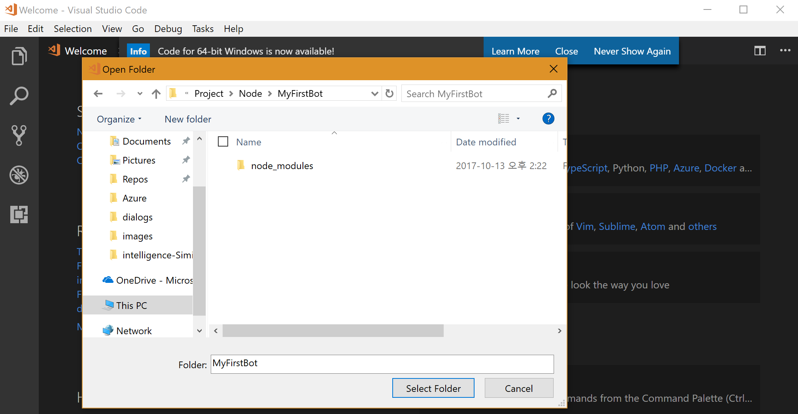
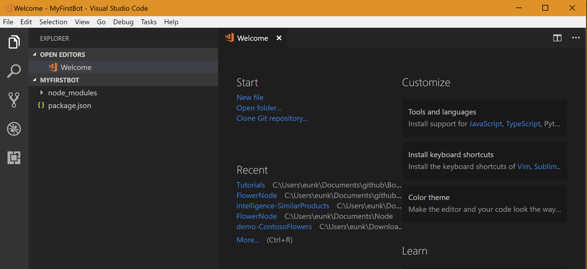

8. 폴더명인 MyFirstBot 옆의 조그만 아이콘을 눌러서 **app.js** 파일을 생성하시기 바랍니다. 
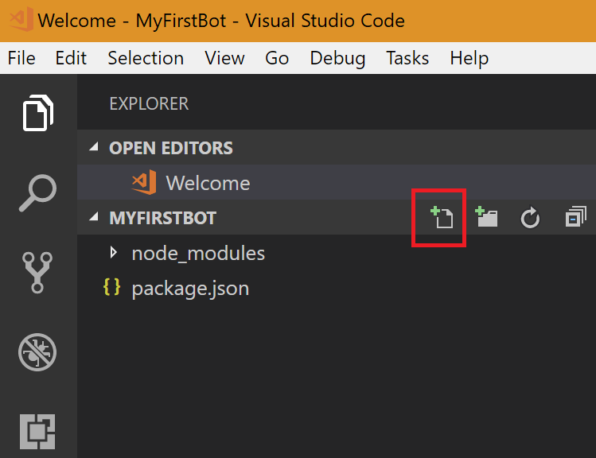
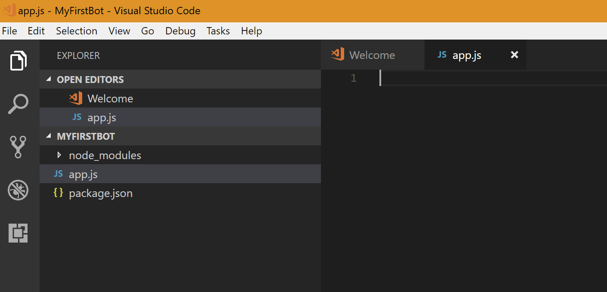

9. 처음으로 만들어 볼 봇은 내가 한말을 똑같이 따라하는 봇 입니다!. app.js 내부에 다음의 소스코드를 복사하여 붙여넣으시기 바랍니다 :)
```
// 개발 시 필요한 패키지들을 포함시키는 부분
var restify = require('restify');
var builder = require('botbuilder');

// Restify Server 셋팅과정
var server = restify.createServer();
server.listen(process.env.port || process.env.PORT || 3978, function () {
   console.log('%s listening to %s', server.name, server.url); 
});

// Bot Framework 서비스랑 커뮤니케이션하기 위해 Chat connector 생성하는 과정
var connector = new builder.ChatConnector({
    appId: process.env.MICROSOFT_APP_ID,
    appPassword: process.env.MICROSOFT_APP_PASSWORD
});

// 사용자 메세지 기다리는 부분 
server.post('/api/messages', connector.listen());

// 사용자에게 응답을 보내주는 부분
var bot = new builder.UniversalBot(connector, function (session) {
    session.send("%s 라고 말하셨죠?!", session.message.text);
});
```

10. 봇을 동작시키기 위해 추가로 설치해야 하는 패키지가 있습니다. 명령행 창에 **npm install --save restify** 명령어를 입력하여 해당 패키지를 설치하시기 바랍니다. 
```
npm install --save restify
```
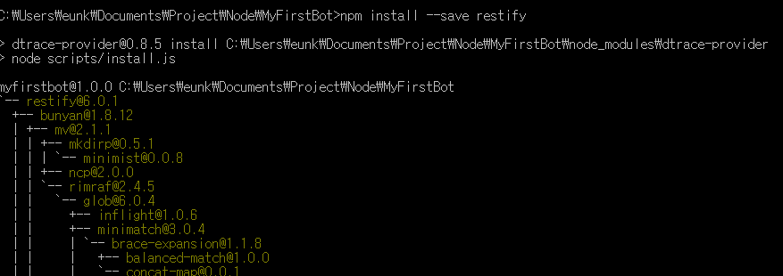

11. 봇이 잘 동작하는지 테스트 해보겠습니다. 명령행 창에서 **node app.js**를 입력하여 봇을 실행시키시기 바랍니다.
```
node app.js
```


12. 앞의 설치과정에서 다운받은 Bot Emulator를 여신 후에, Settings(점 3개가 표시된)를 클릭하고, 아래의 그림과 같이 localhost로 실행되고 있는 주소를 입력하신 후 CONNECT 버튼을 누르시기 바랍니다. 
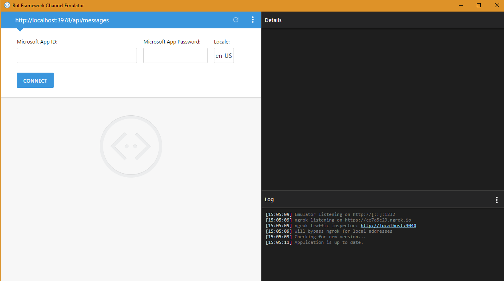

13. 입력창에 하고 싶은말을 입력하셔서 봇이 잘 동작하는지 확인하시기 바랍니다. 
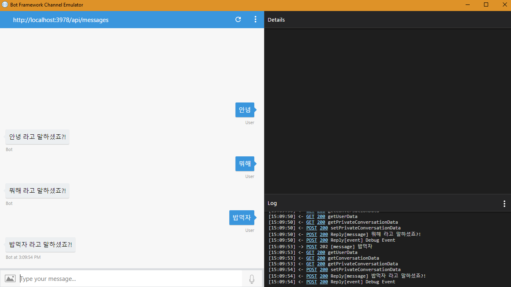

수고하셨습니다! 다음 번 튜토리얼에서는 조금 더 재미있는 봇을 만들어 보도록 하겠습니다! 


