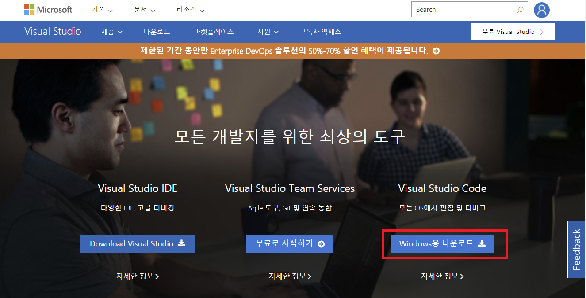

# Node.js 로 챗봇 개발하기

안녕하세요, Microsoft Bot Framework에서는 Node.js 용 Bot Builder SDK를 제공하기 떄문에 누구나 봇을 쉽게 만들 수 있습니다.  기반의 챗봇을 개발하기 위해 필요한 환경구성을 설명해드립니다.

## 설치해야 하는 것

* [Node.js](https://nodejs.org/en/)
: Node.js는 자바스크립트 언어로 작성되는 서버 개발에 주로 쓰이는 소프트웨어 플랫폼 입니다. 위의 링크를 통해 다운받으실 수 있으며 설치 방법은 [생활코딩의 nodejs 설치 강좌](https://opentutorials.org/course/2136/11852)를 참고해보시기 바랍니다. :)

* (Optional) [Visual Studio Code](https://www.visualstudio.com/ko/)
: Visual Studio Code는 Microsoft에서 만든 에디터입니다. 써보면 아시겠지만 가볍고 여러 유용한 기능들을 많이 제공하기 때문에 개발시 생산성을 무척 높일 수 있습니다. 

* (Optional) [Git](https://git-scm.com/book/ko/v1/%EC%8B%9C%EC%9E%91%ED%95%98%EA%B8%B0-Git-%EC%84%A4%EC%B9%98)
: 소프트웨어의 형상 관리를 위한 도구로 앞으로 만들 프로젝트의 소스코드 관리 및 github에 올라와있는 여러 샘플들을 다운로드 받을 때 유용합니다. 

## 시작하기

