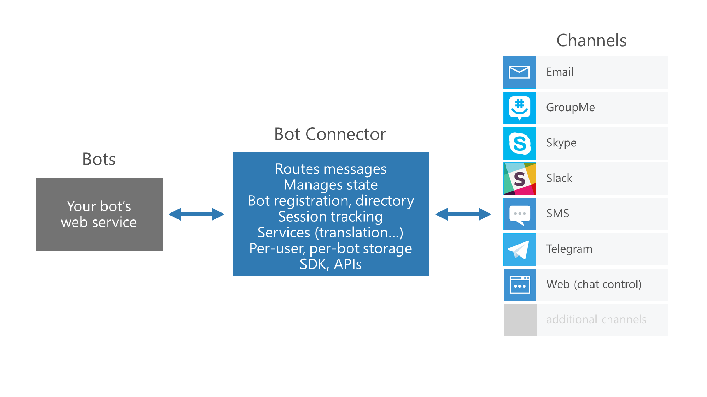
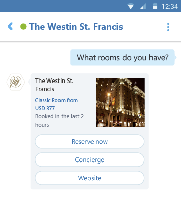
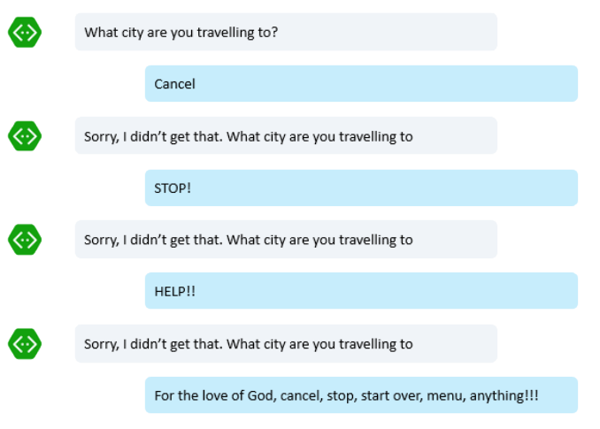

# Microsoft Bot Framework 사용하기 전 알아야 할 주요 개념들!

## Connector

우리가 개발하게 될 봇의 핵심부분이 바로 Connector를 이용하게 될 것 입니다. Connector 부분을 개발한 다음에는 마이크로소프트에서 지원하는 여러 채널인(페이스북 메신저 및 Skype, Slack 등등)에 쉽게 우리가 만든 봇을 배포할 수 있습니다. 그래서 Connector가 무엇이나? 예를들어 우리가 페이스북 메신저에 우리가 만든 봇을 배포했다고 가정해봅시다. 페이스북 메신저로부터 메세지를 받으면 Connector에서 이를 처리하는 것 입니다. HTTPS POST를 이용하여 메세지를 주고 받습니다. 

## Messages

봇에서 사용자에게 보내는 일반적인 타입의 메세지는 Text 입니다. Microft Bot Framework에서는 텍스트 형태의 메세지를 포함하여 사용자들이 보기 편한 풍부한 메세지 타입을 지원합니다. 그중하나가 Hero Card 라는 형태의 카드 메세지 입니다. 이처럼 Bot Framework에서 제공하는 다양한 Message타입을 활용하여 사용자와 효율적으로 커뮤니케이션 할 수 있습니다. 

## Dialog

봇을 잘 구성하기 위해서는 Dialog에 대한 이해가 핵심이라고 해도 과언이 아닙니다. 봇은 결국 사용자와 수 많은 대화를 나눌 것이고 대화는 여러 맥락들로 구성되어 있습니다. 사용자와의 대화 전체가 Bot Framework 내부에서 사용되는 Conversation을 지칭하는 것이고, 대화 중간 중간의 맥락 하나가 Dialog라고 이해하시면 편합니다. 오늘 날씨에 대해 사용자가 물어보다가 갑자기 피자 주문을 할 수 있습니다. (변덕쟁이 우후훗!) 그럼 그 두가지 맥락은 다르게 처리해야 하고, 각각을 다른 Dialog로 구성하시면 좋습니다. 
Dialog 구성에 대한 전문가의 깊이있는 세션을 들어보고 싶다면 다음의 링크를 참고하시기 바랍니다. 
* [Dialog management in Bot Framework by Christopher Harrison](https://channel9.msdn.com/Events/Build/2017/P4070)

## Actions 

사용자와 봇이 대화를 이어나가다 갑자기 하던 것을 중지하고 발생한 상황에 대해 대처해야 할 수도 있습니다.
다음의 예제를 함께 보시기 바랍니다. 

이 경우 계속 기존의 대화를 이어가는 것이 바람직할까요? 이 경우에는 Action 메소드 중 하나를 이용하여 특정 키워드 '그만, stop, help'과 같은 것이 입력되었을때 해당 상황에 맞게 적절하게 대응할 수 있습니다. 
Action과 관련하여 자세한 사항이 궁금하시면 [Handle user actions](https://docs.microsoft.com/en-us/bot-framework/nodejs/bot-builder-nodejs-dialog-actions)를 참고하시기 바랍니다...

## Recognizers 

사용자가 '멈춰주세요, 그만, 중지하고 싶습니다..' 등등을 입력했다면, 전부 Stop이란 의도(intent)에서 말한 것으로 간주할 수 있습니다. Recognizer를 이용하면 사용자의 메세지로부터 의도를 파악하여 적절하게 대응할 수 있습니다.
Recognizer로는 이미 기존에 Built-in으로 구현되어있는 RegExpRecognizer를 이용하실 수도 있으며, 아니면 직접 Custom으로 만드실 수도 있습니다. 혹은 마이크로소프트에서 만든 자연어 처리 서비스인 [LUIS](https://www.luis.ai/home)를 이용하여 사용자의 의도를 쉽게 분석하고 상황에 맞는 Recognizer를 활용할 수 있습니다. 
* [Recognize user intent from message content](https://docs.microsoft.com/en-us/bot-framework/nodejs/bot-builder-nodejs-recognize-intent-messages)
* [Recognize intents and entities with LUIS](https://docs.microsoft.com/en-us/bot-framework/nodejs/bot-builder-nodejs-recognize-intent-luis)
* [Microsoft LUIS Tutorial](https://vimeo.com/145499419)

## Saving State

Bot Builder SDK는 추후 봇 서비스의 확장성을 고려하여 Stateless하게 설계되었습니다. 하지만 때로는 봇과 했던 마지막 대화라던지 대화의 Context를 기억하는 것도 중요합니다. 이를 위해 bot의 data를 저장하기 위한 별도의 Storage공간을 가지고 있으며 상황에 맞게 적절한 용도로 데이터를 기억할 수 있도록 다음 4가지의 Properties를 제공합니다. 
* userData
* conversationData
* privateConversationData
* dialogData
자세한 정보는 [Manage state Data](https://docs.microsoft.com/en-us/bot-framework/nodejs/bot-builder-nodejs-state)를 참고하시기 바랍니다. 

이번 튜토리얼은 [Key concepts in the Bot Builder SDK for Node.js](https://docs.microsoft.com/en-us/bot-framework/nodejs/bot-builder-nodejs-concepts) 글을 기반으로 작성하였습니다. 다음 튜토리얼에서는 실제 다이얼로그를 구성해보는 내용을 다룰 것 입니다. 

