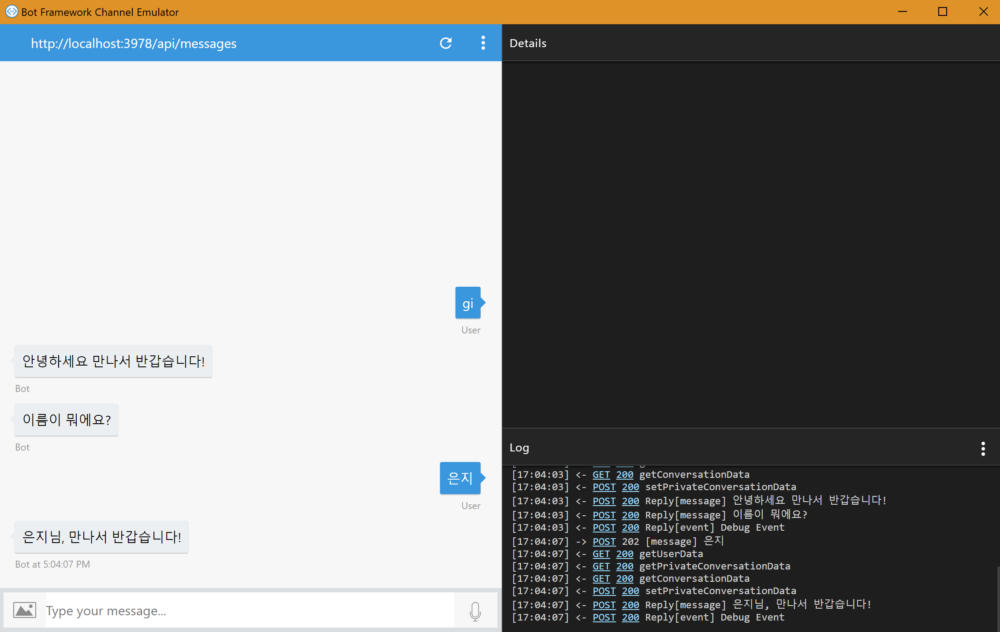
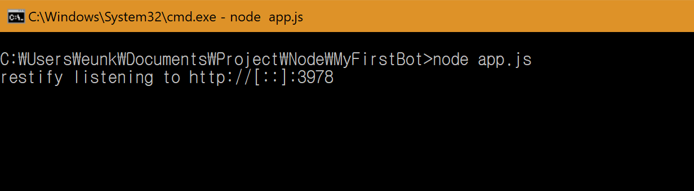
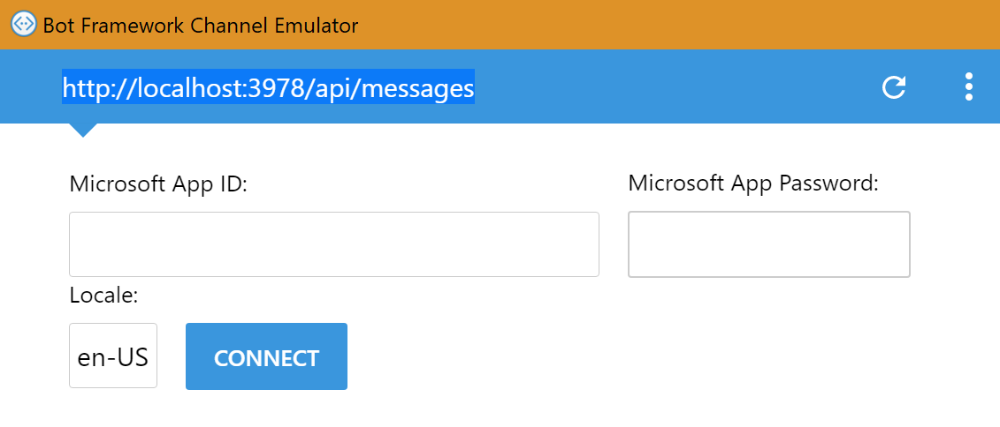

# 다이얼로그로 대화의 흐름 만들기

[01.개발환경 구성.md](https://github.com/angie4u/BotFramework/blob/master/Tutorials/01.%EA%B0%9C%EB%B0%9C%ED%99%98%EA%B2%BD%20%EA%B5%AC%EC%84%B1.md)에서 사용했던 소스코드에서부터 시작을 해보도록 하겠습니다! 

```
// 개발 시 필요한 패키지들을 포함시키는 부분
var restify = require('restify');
var builder = require('botbuilder');

// Restify Server 셋팅과정
var server = restify.createServer();
server.listen(process.env.port || process.env.PORT || 3978, function () {
   console.log('%s listening to %s', server.name, server.url); 
});

// Bot Framework 서비스랑 커뮤니케이션하기 위해 Chat connector 생성하는 과정
var connector = new builder.ChatConnector({
    appId: process.env.MICROSOFT_APP_ID,
    appPassword: process.env.MICROSOFT_APP_PASSWORD
});

// 사용자 메세지 기다리는 부분 
server.post('/api/messages', connector.listen());

// 사용자에게 응답을 보내주는 부분
var bot = new builder.UniversalBot(connector, function (session) {
    session.send("%s 라고 말하셨죠?!", session.message.text);
});
``` 

여기서 우리가 주목해야 하는 부분은 마지막 입니다. UniversalBot은 기본 대화 상자로 대화 상자가 비어있을 때 실행됩니다.  

그럼 처음에 봇이 인사를 하고, 사용자의 입력을 기다고, 다시 답변하는 형태로 바꾸어 보겠습니다. 
다음과 같이 마지막 부분을 바꾸시기 바랍니다. 

```
var bot = new builder.UniversalBot(connector, [
    function (session) {
        session.send('안녕하세요 만나서 반갑습니다!');
        builder.Prompts.text(session, '이름이 뭐에요?');
    },
    function (session, results) {
        session.endDialog(`${results.response}님, 만나서 반갑습니다!`);
    }
]);
```


위의 코드에서 session.send()는 사용자에게 메세지를 보내는 부분이고, 사용자의 입력을 받기 위해서는 builder.Prompts.text()라는 것을 이용하시면 됩니다. 그리고 대화를 종료하기 위해서는 session.endDialog()를 이용하시기 바랍니다.

이제 봇을 실행하여 결과를 확인해 보겠습니다. **node app.js** 명령어를 입력하여 봇을 실행시킨 후, Bot Emulator 열어서 Endpoint 설정을 알맞게 하신 후, 봇과 대화해보시기 바랍니다. 






봇이 잘 동작하는 것을 확인할 수 있습니다. 다음 튜토리얼에서는 다이얼로그를 여러개 구성하는 실습을 해보도록 하겠습니다. :)


