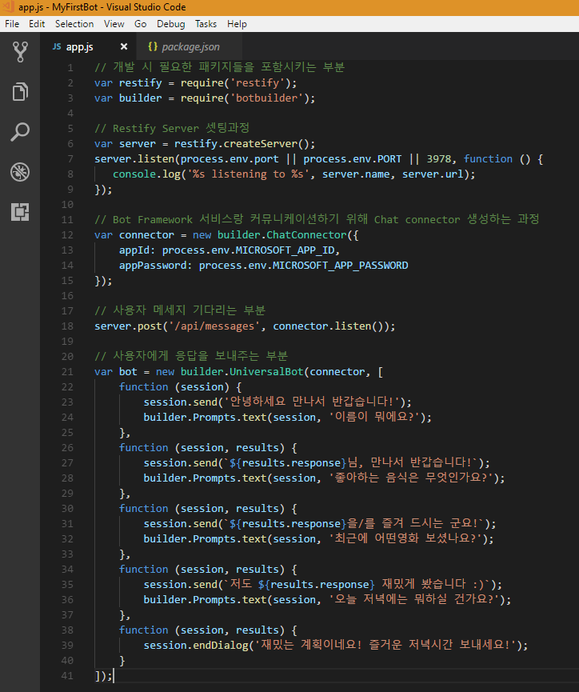
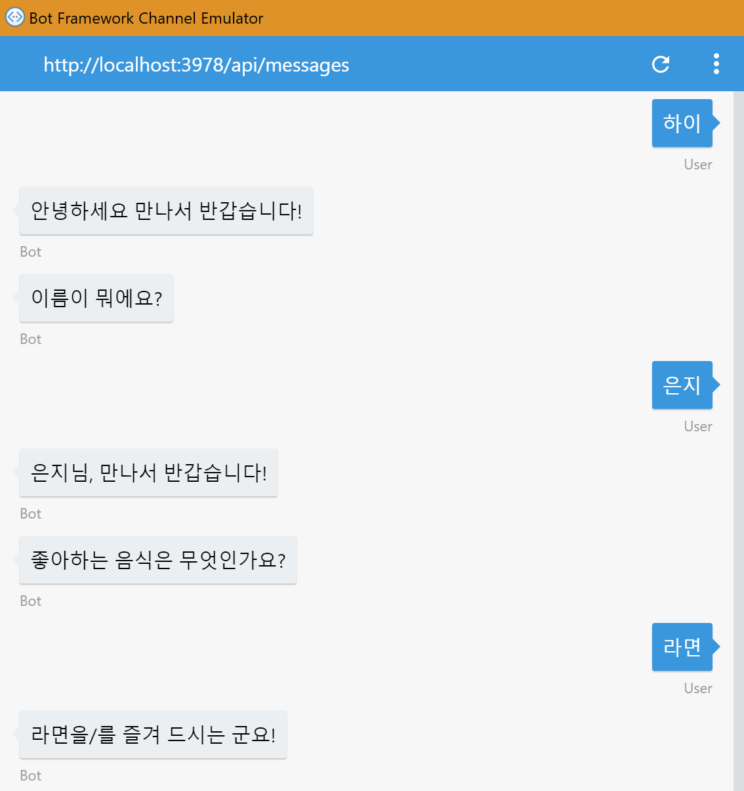
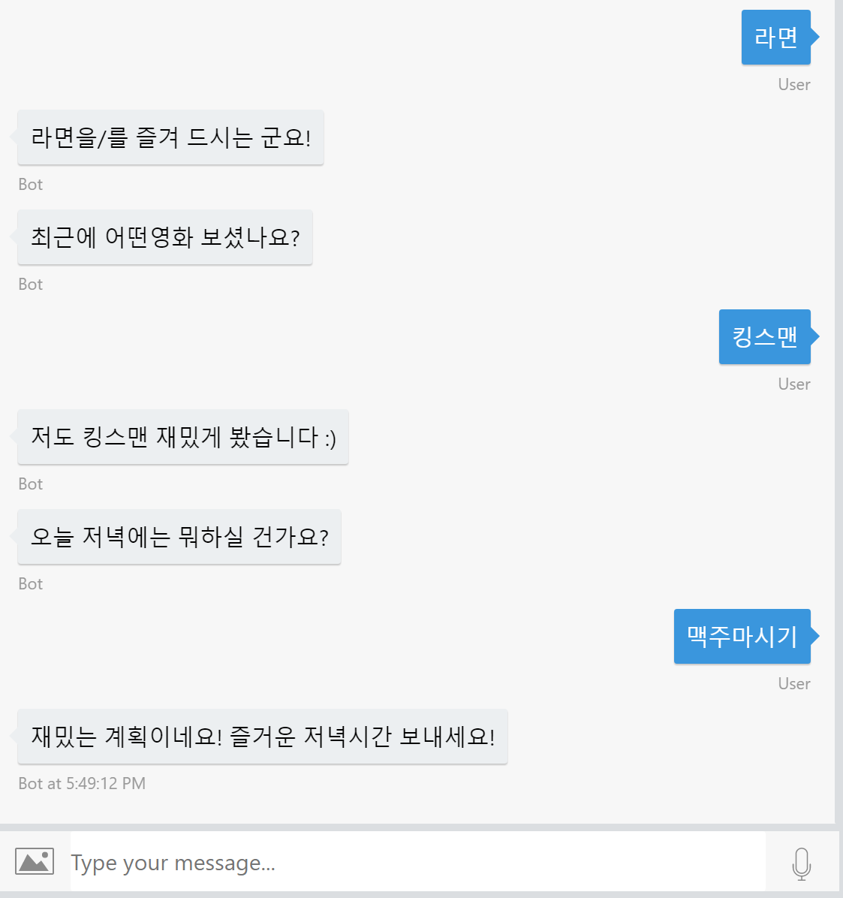

# 여러개의 다이얼로그로 대화의 흐름 만들기

[03.기본 다이얼로그 구성.md](https://github.com/angie4u/BotFramework/blob/master/Tutorials/03.%EA%B8%B0%EB%B3%B8%20%EB%8B%A4%EC%9D%B4%EC%96%BC%EB%A1%9C%EA%B7%B8%20%EA%B5%AC%EC%84%B1.md) 에서 다이얼로그 구성하는 방법에 대해 알아보았습니다. 

전의 튜토리얼에서 다루었던 다이얼로그에 다음의 질문을 추가해보도록 하겠습니다. 
* 좋아하는 음식은 무엇인가요? 
* 최근에 어떤영화 보셨나요?
* 오늘 저녁에는 뭐하실 건가요? 

앞의 단계를 잘 이해하셨다면 어렵지 않게 구성하실 수 있을 것이라고 봅니다. 완성된 소스코드는 다음과 같습니다. 

```
var bot = new builder.UniversalBot(connector, [
    function (session) {
        session.send('안녕하세요 만나서 반갑습니다!');
        builder.Prompts.text(session, '이름이 뭐에요?');
    },
    function (session, results) {
        session.send(`${results.response}님, 만나서 반갑습니다!`);
        builder.Prompts.text(session, '좋아하는 음식은 무엇인가요?');
    },
    function (session, results) {
        session.send(`${results.response}을/를 즐겨 드시는 군요!`);
        builder.Prompts.text(session, '최근에 어떤영화 보셨나요?');
    },
    function (session, results) {
        session.send(`저도 ${results.response} 재밌게 봤습니다 :)`);
        builder.Prompts.text(session, '오늘 저녁에는 뭐하실 건가요?');
    },
     function (session, results) {
        session.endDialog('재밌는 계획이네요! 즐거운 저녁시간 보내세요!');        
    }
]);
```



이전 튜토리얼에서 안내된 바와 같이 bot 부분의 코드를 수정하시고 실행하시면 다음과 같은 결과를 확인하실 수 있습니다. 





위와 같이 일련의 대화를 구성하는 방식을 Waterfall 방식이라고 부릅니다. 하나의 Function은 전체 프로세스 중 하나의 단계를 담당하고 있습니다.
하지만 위와 같은 방식으로 대화를 구성하다보면, 대화가 너무 길어져서 관리에 어려움이 발생할 수 있습니다. 
대화의 단위를 더욱 작게 나누고 싶은 경우, 아래의 예제와 같이 구성을 하실 수 있습니다. 

```
var bot = new builder.UniversalBot(connector, [
    function (session) {
        session.send('안녕하세요 만나서 반갑습니다!');
        session.beginDialog('askForPersonalInfo');        
    },
    function(session,results){
        session.dialogData.tonightPlan = results.response;
        session.endDialog(`${session.dialogData.tonightPlan}라니! 재밌는 계획이네요! 즐거운 저녁시간 보내세요!`);    
    }
]);

bot.dialog('askForPersonalInfo',[
    function(session){
        builder.Prompts.text(session, '이름이 뭐에요?');
    },
    function (session, results) {
        session.send(`${results.response}님, 만나서 반갑습니다!`);
        builder.Prompts.text(session, '좋아하는 음식은 무엇인가요?');
    },
    function (session, results) {
        session.send(`${results.response}을/를 즐겨 드시는 군요!`);
        builder.Prompts.text(session, '최근에 어떤영화 보셨나요?');
    },
    function (session, results) {
        session.send(`저도 ${results.response} 재밌게 봤습니다 :)`);
        builder.Prompts.text(session,'오늘 저녁에는 뭐하실 건가요?');        
    },
    function(session,results){
        session.endDialogWithResult(results);
    }
]);
```

위의 예제는 UniversalBot 안에 개별 function으로 구성되어있던 대화를 **askForPersonalInfo** 라는 대화로 분리하여 구성하였고 끝난 후에는 다시 대화가 진행되던 부분으로 이어지게끔 구성하였습니다.
위와 같은 방식으로 적절한 크기로 대화를 나누어 구성하면 나중에 가독성이나, 유지보수 측면에서도 유리하겠군요! :)


