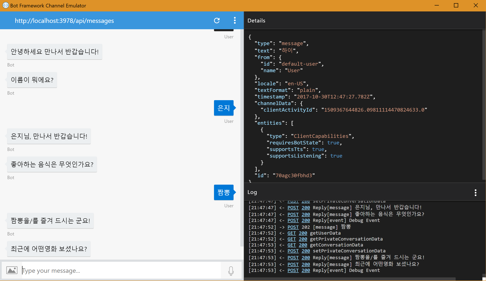
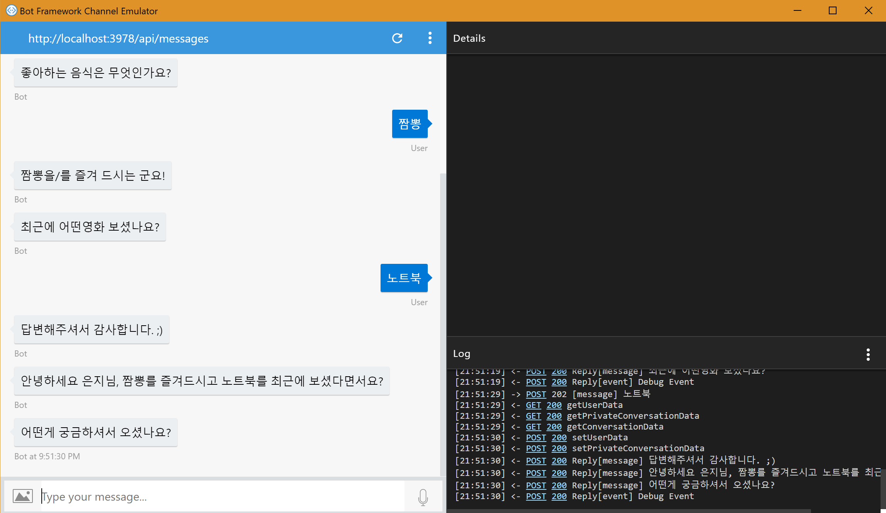
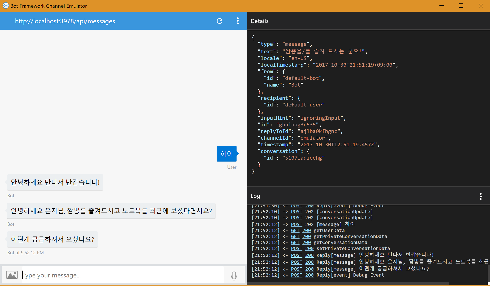

# 다이얼로그 구성 심화

[04. 여러개의 다이얼로그 구성](./04.여러개의 다이얼로그 구성.md)에서는 다이얼로그를 여러개로 구성하는 방법에 대해서 알아보았습니다. 
그럼 이번시간에는 다이얼로그를 다루는 몇가지 Tip & Trick에 대해 말씀드리겠습니다. 

대화중간의 내용이나, 사용자의 정보들을 저장하고 싶은 경우가 생기시죠? 예를들어 초기 1회 사용자 정보를 입력 받는 경우는 한번만 입력 받으면 되는 정보 입니다. 
**next**란 function을 이용하면, 다음 단계를 진행할 수가 있으며 **userData**와 **dialogData**를 적절하게 이용하여 사용자 데이터를 효과적으로 관리하실 수 있습니다. 
다음의 예시를 함께 보면서 설명드리도록 하겠습니다.  

```
var bot = new builder.UniversalBot(connector, [
    function (session) {
        session.send('안녕하세요 만나서 반갑습니다!');
        session.beginDialog('askForPersonalInfo',session.userData.profile);        
    },
    function(session,results){
        session.userData.profile = results.response;
        session.send(`안녕하세요 ${session.userData.profile.name}님, ${session.userData.profile.favoriteFood}를 즐겨드시고 ${session.userData.profile.favoriteMovie}를 최근에 보셨다면서요?`);
        session.send('어떤게 궁금하셔서 오셨나요?');       
    }
]);

bot.dialog('askForPersonalInfo',[
    function(session, args, next){
        session.dialogData.profile = args || {};
        if(!session.dialogData.profile.name){
            builder.Prompts.text(session,'이름이 뭐에요?');
        }else{
            next();
        }        
    },
    function (session, results, next) {
        if(results.response){
            session.dialogData.profile.name = results.response;
            session.send(`${results.response}님, 만나서 반갑습니다!`);
        }
        if(!session.dialogData.profile.favoriteFood){
            builder.Prompts.text(session, '좋아하는 음식은 무엇인가요?');
        }else{
            next();
        }        
    },
    function (session, results, next) {
        if(results.response){
            session.dialogData.profile.favoriteFood = results.response;
            session.send(`${results.response}을/를 즐겨 드시는 군요!`);
        }
        if(!session.dialogData.profile.favoriteMovie){
            builder.Prompts.text(session, '최근에 어떤영화 보셨나요?');
        }else{
            next();
        }     
       
    },
    function (session, results) {
        if(results.response){
            session.dialogData.profile.favoriteMovie = results.response;
            session.send('답변해주셔서 감사합니다. ;)');
        }
        session.endDialogWithResult({response: session.dialogData.profile});
    }    
]);
```

UserData에 데이터가 초기화 되지 않은 경우




UserData에 데이터가 이미 입력 된 경우 -> 이전의 정보를 기억하고 묻지 않는다 +_+



State data 관리와 관련하여 더 자세한 정보가 궁금하신 분들은 다음의 포스트를 참고하시기 바랍니다. 
* [Manage State data](https://docs.microsoft.com/en-us/bot-framework/nodejs/bot-builder-nodejs-state)